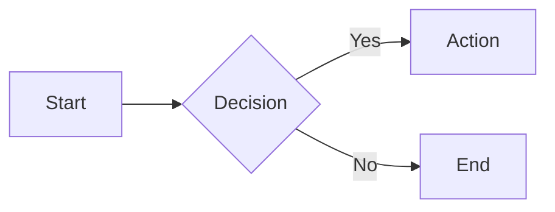

# Outputs & Layouts

## Cell Outputs

The **last expression** in a cell is its output. Any Python object can be an output.

```python
# This is the output
"Hello, world!"
```

```python
# DataFrame becomes interactive table
df
```

```python
# Plot renders automatically
chart
```

## Markdown

### Basic Markdown

```python
mo.md("# Heading\n\nParagraph with **bold** and *italic*.")
```

### Dynamic Markdown (f-strings)

Interpolate Python values:

```python
name = "Alice"
score = 95

mo.md(f"""
# Report for {name}

Final score: **{score}%**
""")
```

### Embed UI Elements

```python
slider = mo.ui.slider(1, 100)

mo.md(f"""
## Configuration

Select value: {slider}

Current: {slider.value}
""")
```

### LaTeX Math

```python
mo.md(r"""
The quadratic formula:

$$x = \frac{-b \pm \sqrt{b^2 - 4ac}}{2a}$$

Inline math: $E = mc^2$
""")
```

### Mermaid Diagrams

````python
mo.md("""

""")
````

### Admonitions / Callouts

```python
mo.callout("This is important!", kind="warn")
# Kinds: "info", "warn", "danger", "success"
```

Or in markdown:

```python
mo.md("""
!!! note "Title"
    Content here
""")
```

## Multiple Outputs

A cell can only have one output. Use these to combine:

### Vertical Stack

```python
mo.vstack([
    mo.md("# Title"),
    chart,
    table
])
```

With gap:

```python
mo.vstack([item1, item2], gap=2)  # gap in rem units
```

### Horizontal Stack

```python
mo.hstack([
    left_panel,
    right_panel
])
```

With alignment:

```python
mo.hstack([a, b], justify="space-between", align="center")
# justify: "start", "center", "end", "space-between", "space-around"
# align: "start", "center", "end", "stretch"
```

### Grid

```python
mo.hstack([
    mo.vstack([a, b]),
    mo.vstack([c, d])
])
```

## Layout Components

### Tabs

```python
mo.ui.tabs({
    "Overview": overview_content,
    "Data": data_table,
    "Charts": chart_content
})
```

### Accordion

Collapsible sections:

```python
mo.accordion({
    "Section 1": content1,
    "Section 2": content2,
    "Section 3": content3
})
```

### Sidebar

Fixed sidebar navigation:

```python
mo.sidebar([
    mo.md("# Navigation"),
    nav_links,
    settings_panel
])
```

### Carousel

Swipeable content:

```python
mo.carousel([slide1, slide2, slide3])
```

### Tree View

```python
mo.tree({
    "Root": {
        "Child 1": "Leaf",
        "Child 2": {
            "Grandchild": "Leaf"
        }
    }
})
```

## Status & Progress

### Progress Bar

```python
with mo.status.progress_bar(total=100) as bar:
    for i in range(100):
        do_work()
        bar.update()
```

### Spinner

```python
with mo.status.spinner("Loading..."):
    result = slow_operation()
```

### Toast Notifications

```python
mo.toast("Operation complete!", kind="success")
# Kinds: "info", "success", "warn", "danger"
```

## Conditional Output

### Show/Hide

```python
show_details = mo.ui.checkbox(label="Show details")

mo.md(f"""
Summary here...

{mo.md("**Details:** ...") if show_details.value else ""}
""")
```

### mo.stop for Conditional Cells

```python
data_loaded = mo.ui.checkbox(label="Data ready")

mo.stop(
    not data_loaded.value,
    mo.callout("Check the box when data is ready", kind="info")
)

# This only runs if checkbox is checked
process_data()
```

## Media

### Images

```python
mo.image("path/to/image.png")
mo.image("https://example.com/image.png")
mo.image(bytes_data, format="png")
```

### Video

```python
mo.video("video.mp4")
mo.video("https://example.com/video.mp4")
```

### Audio

```python
mo.audio("audio.mp3")
```

### PDF

```python
mo.pdf("document.pdf")
```

### Download Button

```python
mo.download(data=csv_string, filename="data.csv", label="Download CSV")
```

## HTML & Styling

### Raw HTML

```python
mo.Html("<div style='color: red'>Custom HTML</div>")
```

### Center Content

```python
mo.center(content)
```

### Plain Text (No Formatting)

```python
mo.plain_text(code_output)
```

### JSON Viewer

```python
mo.json({"key": "value", "nested": {"a": 1}})
```

## App Width

In notebook settings, configure:
- **Compact**: Narrow, centered
- **Medium**: Default
- **Full**: Edge-to-edge

Or set per-cell with CSS.

## Console Output

By default, `print()` output appears below the cell. To capture:

```python
with mo.capture_stdout() as captured:
    print("Hello")
    
captured.getvalue()  # "Hello\n"
```

## Tips

- Use `mo.vstack`/`mo.hstack` to compose complex layouts
- Tabs are great for organizing multiple views
- `mo.stop()` is powerful for step-by-step workflows
- Embed UI elements directly in markdown for clean interfaces
- Use callouts to highlight important information
